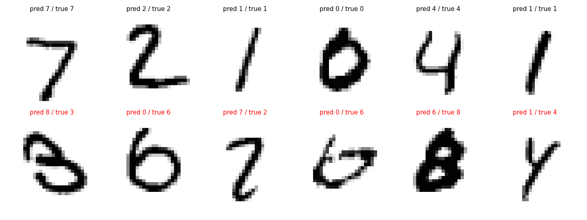
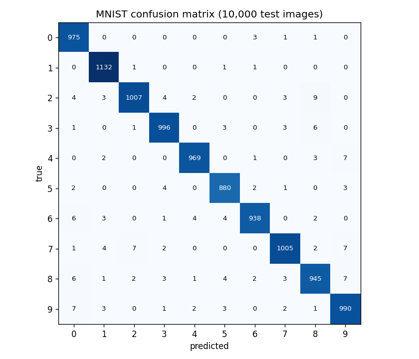

# Handwritten Digit Classifier: a CNN from scratch in NumPy

A small neural network library written from scratch in **NumPy**: no PyTorch, TensorFlow or scikit-learn models. Convolution, pooling, backpropagation and gradient descent are all implemented by hand.

A convolutional neural network built with it classifies **MNIST** handwritten digits (28×28 images) with **98.4% test accuracy**, training in about 1.5 minutes on a laptop CPU.


*Test images with the network's predictions. The bottom row shows mistakes.*

## Quick start

```bash
git clone https://github.com/mbosseva05/numpy-neural-network.git
cd numpy-neural-network
python -m venv .venv && source .venv/bin/activate
pip install -e ".[examples,dev]"

python examples/train_mnist_cnn.py   # CNN on MNIST (downloads the dataset once, ~15 MB)
python examples/train_digits.py      # small fully connected network on 8x8 digits
pytest                               # runs the test suite
```

## The CNN

```
input 1×28×28
→ Conv 3×3, 8 filters  → ReLU → MaxPool 2×2   → 8×14×14
→ Conv 3×3, 16 filters → ReLU → MaxPool 2×2   → 16×7×7
→ Flatten → Linear 784→64 → ReLU → Linear 64→10
```

```python
from numpy_nn import Conv2D, MaxPool2D, Flatten, Linear, ReLU, Network, SoftmaxCrossEntropy, train

net = Network([
    Conv2D(1, 8, 3, padding=1), ReLU(), MaxPool2D(2),
    Conv2D(8, 16, 3, padding=1), ReLU(), MaxPool2D(2),
    Flatten(), Linear(16 * 7 * 7, 64), ReLU(), Linear(64, 10),
])
history = train(net, SoftmaxCrossEntropy(), x_train, y_train, x_val, y_val,
                epochs=3, lr=0.05, batch_size=64)
predictions = net.predict(x_test)
```

## Results

| Model | Dataset | Test accuracy |
|---|---|---|
| CNN (above), 3 epochs | MNIST, 28×28, 10,000 test images | **98.4%** |
| Fully connected 64→64→32→10, 60 epochs | scikit-learn digits, 8×8 | 95.5% |



The most common confusions are between visually similar digits, such as 2 and 8, or 7 and 2 and 9.

For the smaller fully connected model, the validation loss stops improving after about 20 epochs while the training loss keeps falling, which is a sign of mild overfitting:


## What's implemented

| Component | Details |
|---|---|
| `Conv2D` | 2D convolution with stride and padding, implemented with im2col |
| `MaxPool2D` | Max pooling. The gradient flows only to the max element of each block |
| `Flatten` | Converts feature maps into vectors for the fully connected layers |
| `Linear` | Fully connected layer with He initialisation |
| `ReLU`, `LeakyReLU` | Activations |
| `SoftmaxCrossEntropy` | Combined softmax and cross-entropy loss |
| `Network` | Chains layers; runs forward, backward and parameter updates |
| `train` | Full-batch or mini-batch gradient descent with per-epoch train/validation metrics |
| Utilities | Train/validation/test split, accuracy, confusion matrix |

## Design decisions

- **Convolution as matrix multiplication (im2col).** Every 3×3 patch of the input becomes one row of a matrix, so a whole convolution is a single matrix multiplication instead of nested Python loops. In the backward pass (col2im), the gradient of each patch is added back to the pixels it came from. Pixels shared by overlapping patches collect gradient from all of them.
- **Every layer has the same interface (`forward`, `backward`, `step`).** Each layer caches what it needs in `forward` and uses it in `backward`, so the network is just a list of layers.
- **Softmax and cross-entropy are combined.** Together, their gradient simplifies to `(probabilities − one_hot(labels)) / N`, which is cheaper and numerically safer.
- **Numerically stable softmax.** The row maximum is subtracted before `exp()`.
- **He initialisation** (`N(0, 2/fan_in)`) keeps activations from shrinking or exploding through ReLU layers.
- **Batched evaluation** keeps memory use low when measuring accuracy on large datasets.
- **Reproducibility.** All randomness goes through an explicit `numpy.random.Generator`.

## Testing

- **Numerical gradient checks:** every gradient computed by backpropagation (convolution weights and biases, linear layers and inputs) is compared with a central finite-difference estimate. This runs on both a fully connected network and a small CNN with stride and padding.
- **Reference implementation:** the im2col convolution is compared with a direct loop-based convolution.
- Unit tests for max pooling, softmax stability, data splitting and the confusion matrix, plus an end-to-end training test.

## Next steps

- Momentum and Adam optimisers
- Data augmentation (small shifts and rotations)
- Batch normalisation and dropout
- Early stopping and L2 regularisation
