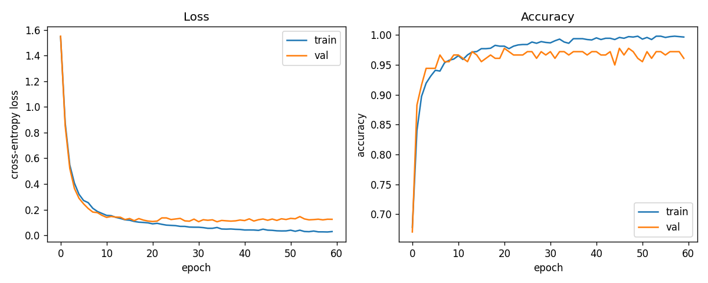
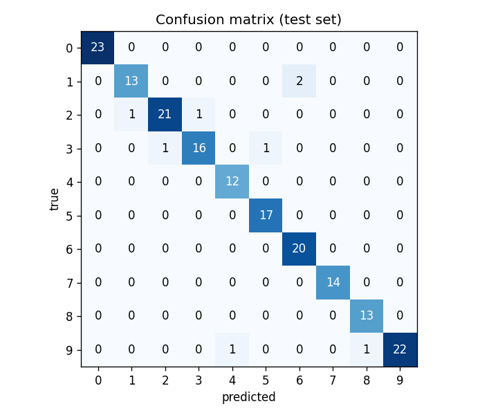

# numpy-nn

A small feed-forward neural network library written from scratch in **NumPy**: no PyTorch, TensorFlow or scikit-learn models. Forward passes, backpropagation and gradient descent are all implemented by hand.

On the scikit-learn handwritten digits dataset (8×8 images, 10 classes), a 3-layer network reaches **~95% test accuracy**.



## Quick start

```bash
git clone https://github.com/mbosseva/numpy-neural-network.git
cd numpy-neural-network
python -m venv .venv && source .venv/bin/activate
pip install -e ".[examples,dev]"

python examples/train_digits.py   # trains the network, saves figures/
pytest                            # runs the test suite
```

## Usage

```python
import numpy as np
from numpy_nn import Linear, ReLU, Network, SoftmaxCrossEntropy, train

rng = np.random.default_rng(0)
net = Network([Linear(64, 32, rng), ReLU(), Linear(32, 10, rng)])

history = train(net, SoftmaxCrossEntropy(), x_train, y_train, x_val, y_val,
                epochs=60, lr=0.05, batch_size=32, rng=rng)
predictions = net.predict(x_test)
```

## What's implemented

| Component | Details |
|---|---|
| `Linear` | Fully connected layer with He initialisation |
| `ReLU`, `LeakyReLU` | Activations with their derivatives |
| `SoftmaxCrossEntropy` | Combined softmax and cross-entropy loss |
| `Network` | Chains layers; runs forward, backward and parameter updates |
| `train` | Full-batch or mini-batch gradient descent with per-epoch train/validation metrics |
| Utilities | Train/validation/test split, accuracy, confusion matrix |

## Design decisions

- **Every layer has the same interface (`forward`, `backward`, `step`).** Each layer caches its input in `forward` and uses it in `backward`, so the network is just a list of layers. Adding a new layer type means writing one class.
- **Softmax and cross-entropy are combined.** Together, their gradient simplifies to `(probabilities − one_hot(labels)) / N`. That is cheaper than backpropagating through softmax separately, and numerically safer.
- **Numerically stable softmax.** The row maximum is subtracted before `exp()`, so large logits don't overflow.
- **He initialisation** (`N(0, 2/fan_in)`) keeps activations from shrinking or exploding through ReLU layers.
- **Reproducibility.** All randomness goes through an explicit `numpy.random.Generator`, so runs with the same seed give the same results.

## Testing

The core test is a **numerical gradient check**: for a small network, every gradient computed by backpropagation (weights, biases and inputs) is compared with a central finite-difference estimate. That verifies the calculus, not just that the code runs. Other tests cover softmax stability, the data split, the confusion matrix, and that training learns a simple separable problem.

## Results

Digits dataset, network `64 → 64 → 32 → 10` with ReLU activations, 60 epochs, mini-batch size 32, learning rate 0.05:

| Train | Validation | Test |
|---|---|---|
| 99.7% | 96.1% | 95.5% |



After about 20 epochs the validation loss stops improving while the training loss keeps falling, which is a sign of mild overfitting.

## Next steps

- Early stopping on validation loss, and L2 regularisation, to address the overfitting
- Momentum and Adam optimisers
- Dropout
- Larger datasets such as MNIST
